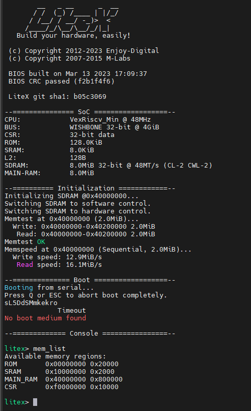

# Generate bitstream for Nano tang 20k using a full opwn source toolchain

The goal of this project is to succesfully demonstrate the use of an open source toolchain to generate a simple bitstream on a Windows 11 computer using WSL Fedora 42.

Install FTDI USB driver:
------------------------
In theory, Windows 11 should recognise the Tang nano 20k board and expose the 2 serial communication ports. I had to install the drivers from Future tech to proceed.

WSL USB serial adaptor:
-----------------------

We need to install usbipd to connect USB devices to our fedora WSL installation. The latest version can be found here

https://github.com/dorssel/usbipd-win/releases

The latest installer is usbipd-win_5.1.0_x64.msi.

Share Windows USB port with Fedora WSL:
---------------------------------------

In powershell in administrator mode, list the avaialble USB devices by typing:

    usbipd.exe list

The result should list a device named "USB Serial Converter A, USB Serial Converter B" with BUSID 2-2 in my case. We can now share this USB with other users by typing:

    usbipd.exe bind --busid=2-2

It is then necessary to start the Fedora 42 WSL instance and then attach the USB 2 serial ports to the WSL instance by typing:

    usbipd.exe attach --wsl --busid=2-2

In WSL, it should now be possible to see the new serial ports by typing:

    ls /dev/ttyUSB*
    lsusb

As a serial terminal in WSL, I choose to use "moserial" which is the default gnome serial terminal.

    sudo dnf install moserial

In Fedora 42, I did not managed to add myself to the dialout group so I ended doing

    sudo chmod 666 /dev/ttyUSB[0-1]

Install YOSYS:
--------------

    read_verilog counter.v
    synth_gowin -top counter -json counter.json -family gw2a

Install nextpnr:
----------------

There is an nexpnr package avaialble in Fedora 42 but it does not support the nanotang 20k device. So it needs to be compiled from sources

    sudo dnf install cmake python3-devel
    sudo dnf install boost-devel eigen3-devel
    mkdir Tools
    git clone https://github.com/YosysHQ/nextpnr.git
    cd nextpnr
    git submodule update --init --recursive
    mkdir build
    cd build
    cmake .. -DARCH="himbaechel" -DHIMBAECHEL_UARCH="gowin"
    make

Then add nextpnr-himbaechel to the execution search path.

    export PATH=$PATH:~/Tools/nextpnr/build
    nextpnr-himbaechel -r --json counter.json --write counter_pnr.json --freq 27 --vopt family=GW2A-18C --vopt cst=tangnano20k.cst --device GW2AR-LV18QN88C8/I7
    gowin_pack -d GW2A-18C -o counter.fs counter_pnr.json

Install openFPGAloader:
-----------------------

openfpgaloader is the tool loading the bitstream into the Tang Nano flash memory from the computer to the board using the USB conector.

    sudo dnf install libftdi-devel
    cd ~/Tools
    git clone https://github.com/trabucayre/openFPGALoader.git
    cd openFPGALoader/
    mkdir build
    cd build/
    cmake ../
    cmake --build .
    sudo make install

Then add openFPGAloader to the execution path:

    export PATH=$PATH:~/Tools/openFPGALoader/build
    sudo openFPGALoader --scan-usb
    sudo openFPGALoader --ftdi-serial 2025030317 counter.fs

Serial Communication with the Tang Nano 20K:
--------------------------------------------

Type help to see all commands. "reboot" boots the FPGA and produces the following boot message.

Knowledge base for Gowin nano tang
---------------------------------------------

Example of constraint file for 4 LVDSs
From https://github.com/verilog-indeed/nano4k_hdmi_tx/blob/main/FPGADesign/nano4k_hdmi_tx/src/nano4k_hdmi_tx.cst

IO_LOC "tmdsChannel_p[2]" 35,34;
IO_PORT "tmdsChannel_p[2]" PULL_MODE=NONE DRIVE=3.5;
IO_LOC "tmdsChannel_p[1]" 32,31;
IO_PORT "tmdsChannel_p[1]" PULL_MODE=NONE DRIVE=3.5;
IO_LOC "tmdsChannel_p[0]" 30,29;
IO_PORT "tmdsChannel_p[0]" PULL_MODE=NONE DRIVE=3.5;
IO_LOC "tmdsClockChannel_p" 28,27;
IO_PORT "tmdsClockChannel_p" PULL_MODE=NONE DRIVE=3.5;
