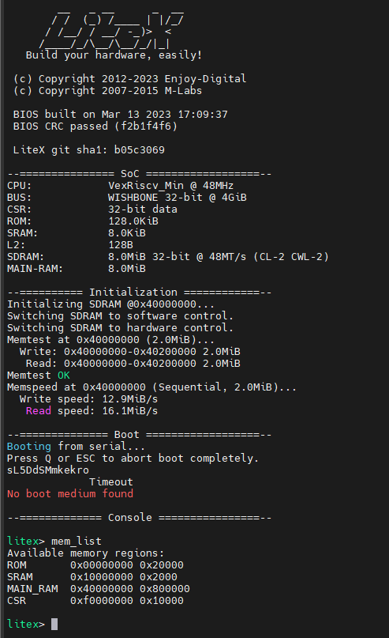

Install FTDI USB driver:
------------------------

WSL USB serial adaptor:
-----------------------

We need to install usbipd to connect USB devices to our fedora WSL installation. The latest version can be found here

https://github.com/dorssel/usbipd-win/releases

The latest installer is usbipd-win_5.1.0_x64.msi.

Share Windows USB port with Fedora
----------------------------------

In powershell in administrator mode, list the avaialble USB devices by typing:

    usbipd.exe list

The result should list a device named "USB Serial Converter A, USB Serial Converter B" with BUSID 2-2 in my case. We can now share this USB with other users by typing:

    usbipd.exe bind --busid=2-2

It is then necessary to start the Fedora 42 WSL instance and then attach the USB 2 serial ports to the WSL instance by typing:

    usbipd.exe attach --wsl --busid=2-2

In WSL, it should now be possible to see the new serial ports by typing:

    ls /dev/ttyUSB*
    lsusb

As a serial terminal in WSL, I choose to use "moserial" which is the default gnome serial terminal.

    sudo dnf install moserial

In Fedora 42, I did not managed to add myself to the dialout group so I ended doing

    sudo chmod 666 /dev/ttyUSB[0-1]

YOSYS
-----

    read_verilog counter.v
    synth_gowin -top counter -json counter.json -family gw2a

Serial Communication with the Tang Nano 20K:
--------------------------------------------

Type help to see all commands. "reboot" boots the FPGA and produces the following boot message.

OpenFPGAloader
--------------

openfpgaloader is the tool loading the bitstream into the Tang Nano flash memory from the computer to the board using the USB conector.

    sudo dnf copr enable mobicarte/openFPGALoader
    sudo dnf install openFPGALoader   
