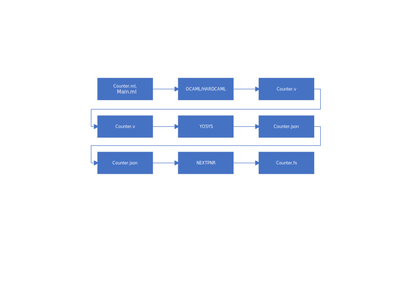

The aim of this project is to use Hardcaml to design a firmware to load on the Tang nano 20k that blinks the leds. This to provide a Hardcaml test framework and to understand how difficult it is to use.

A new tool is introduced compared to [project2](./project2/README.md] which compiles a project descring a FPGA design in Hardcaml (a flavor of OCAML). An executable is generated by this compilation. The execution of this program generates a Verilog file which can then be read by YOSYS.

Install Hardcaml:
-----------------

    opam install hardcaml ppx_hardcaml

Create library:
---------------

We first need to create a new OCAML project by typing

    dune init project project3
    
Create main executable:
-----------------------

The executable is generating the Verilog file.

Conclusion:
-----------
I found the use of Hardcaml quite hard to understand. The ressources are limited on the web.
