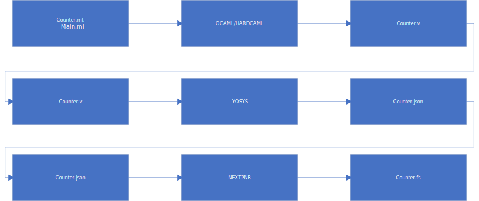

The aim of this project is to use Hardcaml to design a firmware to load on the Tang nano 20k that blinks the leds. This to provide a Hardcaml test framework and to understand how difficult it is to use.

Install Hardcaml:
-----------------

    opam install hardcaml ppx_hardcaml
